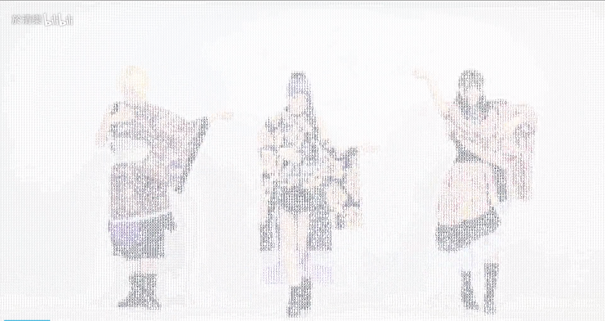

# Video to Chars

[](https://travis-ci.org/ryan4yin/video2chars)
[](https://pypi.org/project/video2chars/)
[](https://app.codacy.com/app/xiaoyin_c/video2chars?utm_source=github.com&utm_medium=referral&utm_content=ryan4yin/video2chars&utm_campaign=Badge_Grade_Dashboard)
[](https://www.python.org/)

Convert video to character art animation.

[中文说明](/doc/README-zh-cn.md)

## Install


Install video2chars:
```
pip install video2chars
```

If you're using an old version of `pip`, maybe you should add `--prefer-binary` to make things go right(or upgrade your pip first):

```shell
pip install video2chars --prefer-binary
```

This tool relies on `imageio-ffmpeg`, but only the binary version of `imageio-ffmpeg` contains the `ffmpeg` binary.
if pip choose the source version, problem will occurs. 

## Usage

```
video2chars --width 120 --end 10 path/of/video_file
```
The command shows that the specified video will be converted to an ascii art animation with the width of 120, and only convert the first 10 seconds. 
you'll see a file named `output.mp4` in your current directory when completes, have fun ~

>p.s. it's a bit slow, turn down the width and fps, to speed up the conversion. 

Check `video2chars --help` for more information.


## Demonstration

[](https://www.bilibili.com/video/av30469888/)


## Old version

[video2chars - v0.3](https://github.com/yuansuye/video2chars/tree/v0.3)

1. shell version demo：


2.  html version demo：


## Article

Shell Version(in Chinese): [视频转字符动画-Python-60行代码](http://www.cnblogs.com/kirito-c/p/5971988.html)

## Related Projects

- [Video2ASCII.jl(Julia Version)](https://github.com/ryan4yin/Video2ASCII.jl): simple implementation in julia.
- [video2ascii-rs(rust version)](https://github.com/ryan4yin/video2ascii-rs): simple implementation in rust.

## Stargazers over time

[](https://starchart.cc/ryan4yin/video2chars)
